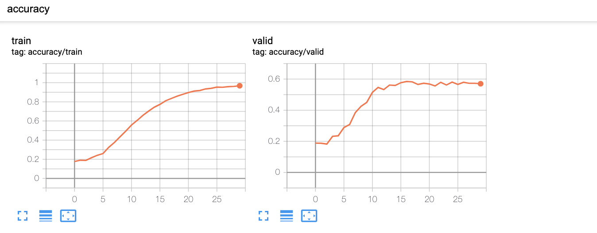
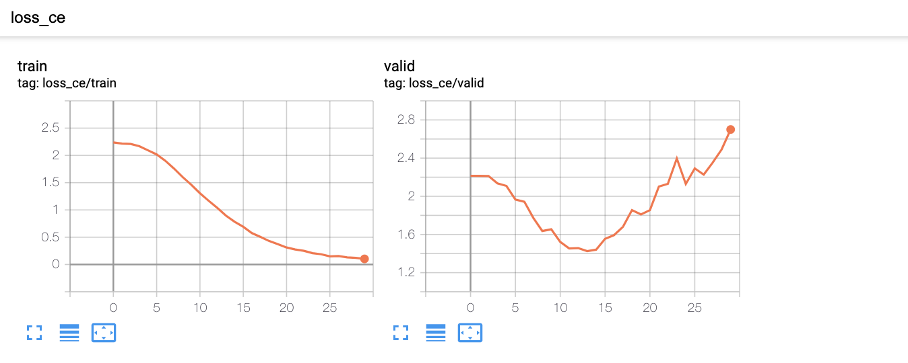
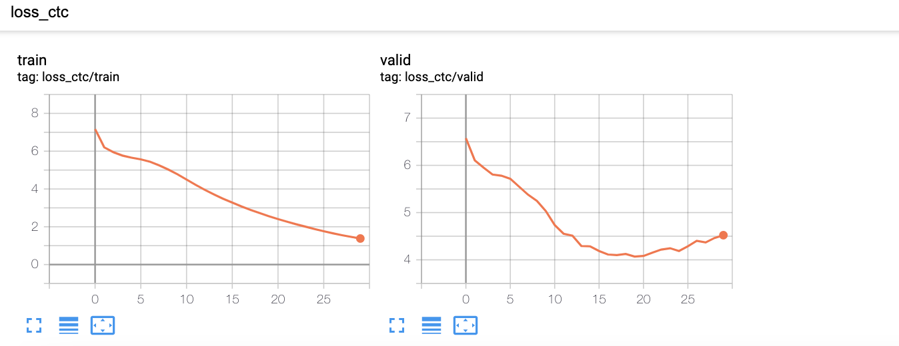

# NYCU DL Final Competition 
###### TA stuff

This is one of the baseline models for the final competition in NYCU 2021 Deep Learning Course

## Kaggle url
* https://www.kaggle.com/c/nycu-dl-final-competition/

## Baseline descriptions
* Model architecture
    * CRNN (Convolutional Recurrent Neural Networks)
* Results
    * training results
        * accuracy
            
        * cross entropy loss
            
        * CTC (Connectionist temporal classification) loss
            
    * test accuracy
        * public: 0.55889
        * private: 0.55061

## Instructions
Get dependencies:
```
pip3 install -r requirements.txt
```

Train the model as default setting:
```
python3 main.py
```

Generate the submission file with per-trained weight
```
python3 main.py --epoch 0 --load True --model_path <model_weight_path> --submission <csv_file_name>
```
